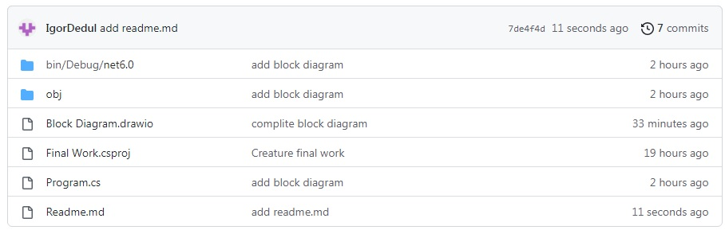

# Итоговая проверочная работа #

## Задние. ##
### Зaдача. ###
Написать программу, которая из имеющегося массива строк формирует новый массив из строк, длина которых меньше, либо равна 3 символам. Первоначальный массив можно ввести с клавиатуры, либо задать на старте выполнения алгоритма. При решении не рекомендуется пользоваться коллекциями, лучше обойтись исключительно массивами.
### Требования. ###
1. Создать репозиторий на GitHub
2. Нарисовать блок-схему алгоритма (можно обойтись блок-схемой основной содержательной части, если вы выделяете её в отдельный метод);
3. Снабдить репозиторий оформленным текстовым описанием решения (файл README.md);
4. Написать программу, решающую поставленную задачу;
5. Использовать контроль версий в работе над этим небольшим проектом (не должно быть так, что всё залито одним коммитом, как минимум этапы 2, 3, и 4 должны быть расположены в разных коммитах).
### Примеры. ###
>[“Hello”, “2”, “world”, “:-)”] → [“2”, “:-)”]

>[“1234”, “1567”, “-2”, “computer science”] → [“-2”]

>[“Russia”, “Denmark”, “Kazan”] → []

$---------------------------------------$
## Выполнение. ##
### Ссылка на репозиторий GitHub. ###
[Репозиторий с работой GitHub](https://github.com/IgorDedul/Final-work.git)  
### Скриншот рапозитория ###

### Оформление блок-схем ###
Блок-схемы оформлены в расширении *Draw.io* для *VS Code*. На первой вкладке изображена схема основной программы, в теле которой закругленными прямоугольниками обозначены входы в методы функций. Блок-схемы описания для каждой функции находятся на отдельных вкладках, с комментариями принимаемых и возвращаемых значений. При использовании встроенных методов, описание метода указано внутри исполняемого блока в скобках. Блок вывода, как и Void-функия вывода обозначены блоком прямоугольника с волнистой стороной, согласно урокам, а не перевернутым парралелограмом.
$---------------------------------------$
## Коментарии написания программы. ##
* Строки **1-6** содержат в себе закомментированное условие задачи с примером для удобства работы.
* Строки **8-10** применены для пользовательского интерфейса.
* Строка **11** принимает от пользователя значение длины массива, либо команду, если пользователь не захочет вводить массив вручную.
 * Строка **24** объявляет нулевой массив, который в последствии будет иметь характеристики на усмотрения пользователя.
 * Строки **25-33** содержат блок, основанный на операторе ветвления. В нем проверяются значения переданные пользователем. В случае передачи положительного числового значения, программа получает команду на переход к функции заполнения массива вручную и использует полученное от пользователя значение для формирование длинны массива. Если пользователь ввёл 0, программа принимает это как команду заполнения массива предложенными по умолчанию значениями. В любом другом случае программа сообщит об ошибке ввода.
 * Строки **13-22** содержат функцию ручного заполнения массива, вход в которую возможен из блока оператора ветвления в случае передачи пользователем положительного числового значения. В случае запуска функции, в строке **15**, введенное пользовательское значение определяет длину заполняемого массива, и в строках **16-20** используя цикл, перебором всех элементов массива от 0-го до последнего, заполняет массив пользовательскими элементами, после чего в строке **16** возвращает заполненный массив в основную программу.
 * Строка **48** отправляет заполненный массив (вручную или заданный) в функцию вывода для ознакомления пользователю.
 * Строки **35-45** содержат функцию вывод заполненного массива. Реализовано циклом, перебирая все элементы массива от 0-го до  последнего длины строки, выводит значения в консоль.
 * Строка **67** отправляет заполненный ранее массив в функцию *"выполнения основного задания"*, т.е. в фунцию составления массива из отобранных по условию элементов.
 Строки **51-65** содержит функцию составления второго массива из отобранных по условию элементов. В строке **53** объявляется пустой массив, длина и содержимое которого определится в резултате перебора циклом ранее созданного массива 1 (строка **55**) и при выполнении условия строки **57**, а именно, если длина элемента не больше трёх символов, то новый массив расширяется на новый элемент (встроенным методом в строке **59**) и заполняя его элементом прошедшим условие из первого массива (строка **60**). В строке **61** срабатывает счётчик объявленный ранее в строке **54**, который используется для перебора заполняемого второго массива. В итоге, после перебора всех элементов первого массива на условие, в строке строке **64** в основную программу возвращается сформированный второй массив, имеющию длину от 0 (если под условие не попал ни один элемент массива 1) и не более длины массива 1 (в случае если все элементы прошли условие).
 * Строка **70** отправляет сформированный второй массив (итоговый) в функцию вывода (строки **35-45** ) для ознакомления пользователю.
 * Программа окончена.

 ## Предлжения по улучшению программы. ##
Программу можно сделать более универсальной, с возможностью формирования массива не только из элементов длинна которых нен более трёх, а из любых на усмотрение прользователя. Для это:
 * В начале программы, вместе с вводом длины массива можно попросить пользователя указать, из какого предела длинны элементов собрать массив;
* Ввести новую переменную, и принять в ней значение, переданное пользователем;
* В строке 57 заменить "3" на эту переменную.